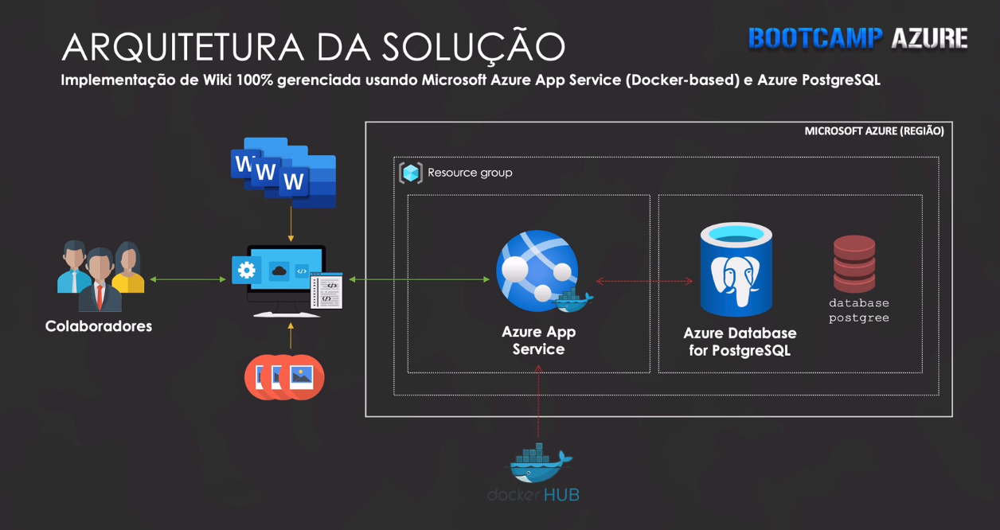

### tcbazurefinalproject

## Deploying 100% managed Wiki using Terraform with Azure App Service (Docker based) and Azure PostgreSQL.

Terraform role to create infrastructure

#Motivation

Imagine that you have a procedure, an important document from your team, or an important process that always needs to be at hand. As it is a procedural document, of operation, they are always being updated. The big problem of having autonomous documents can generate a big inconsistency of data because they are loose.

To solve this problem, it was thought to migrate all these documents to a Wiki in the cloud, 100% Web, which could be accessed by everyone, allowing you to collaborate, create documents in a collaborative format where everyone can see the latest version of the document and propose improvements, making the team better organize the documents.

Who needs this? 
Any business or community that needs to collaboratively create pages, in general, procedures and instructions for its members.

#Requirements

*Azure Azure App Service
*Terraform
*Wiki.js

```yml
What it does:
- [X] Create resource group
- [X] Create PostgreSQL server
- [X] Set Active Directory user or group as the administrator
- [X] Create firewall rule to allow access to Azure services
- [X] Create App Service running docker image of Wiki.js
  
```

## IaC using Terraform
```yml
---
main.tf
output.tf
provider-main.tf
provider-variables.tf
terraform.tfvars
variables.tf

```

*Live :v:
*Love :heart:
*Learn :see_no_evil: :hear_no_evil: :speak_no_evil:

:rocket::rocket::rocket:
*azure
*app service
*docker
*wiki.js
*terraform
*pracima 
*thecloudbootcamp
